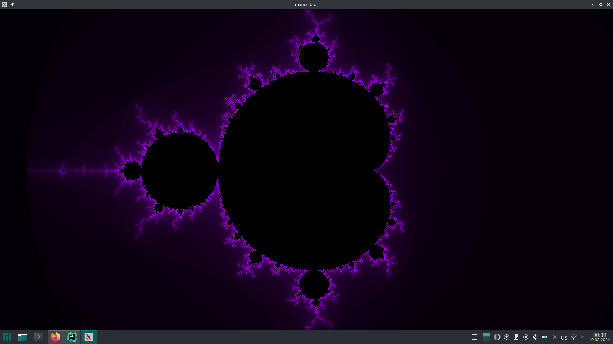
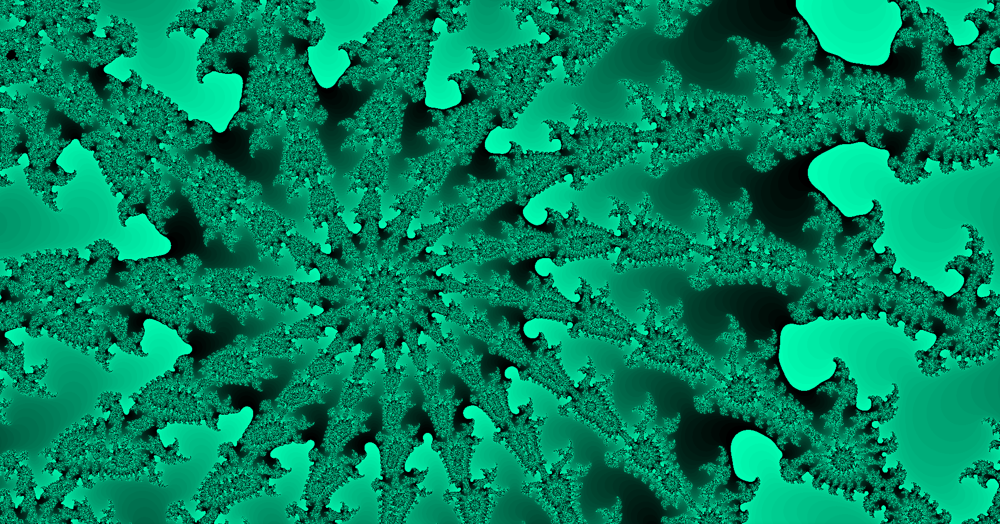
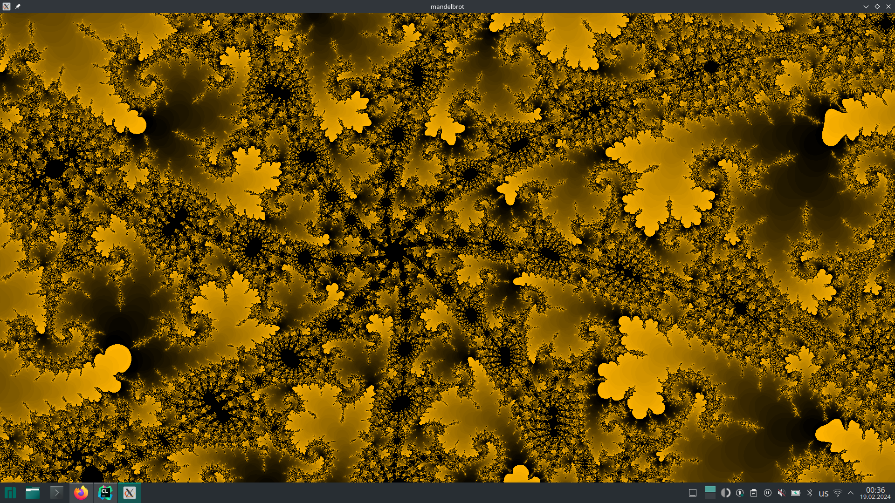
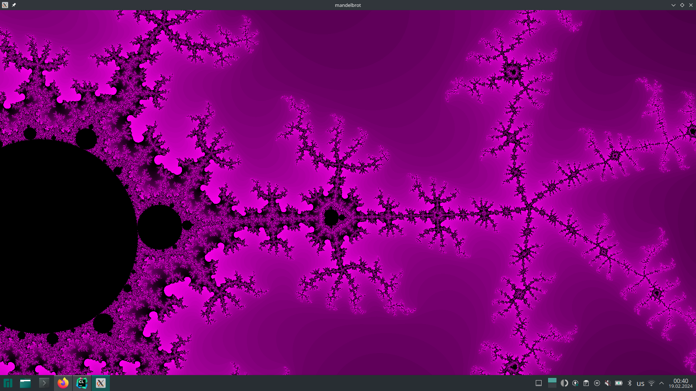
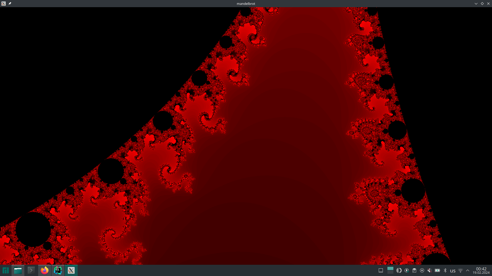
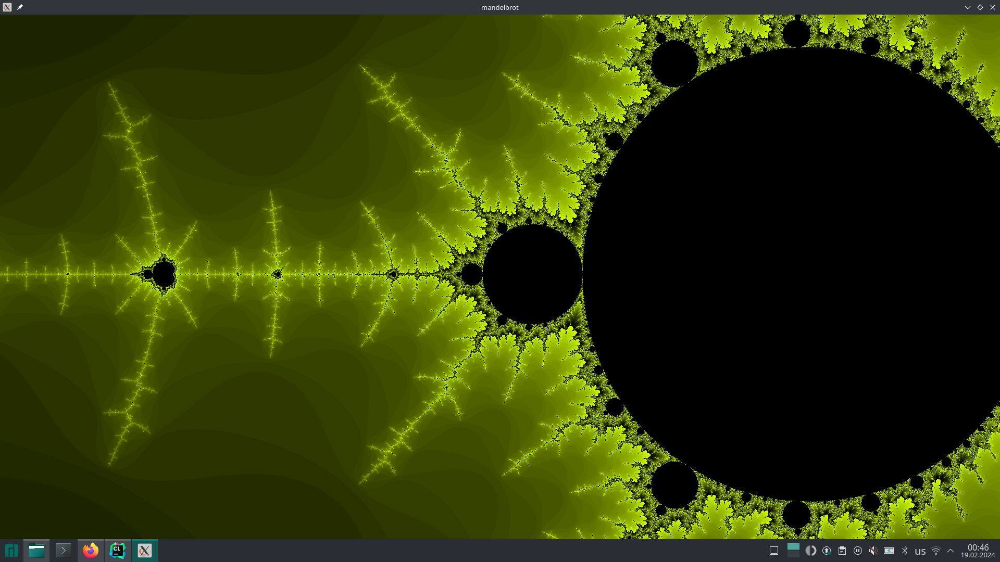
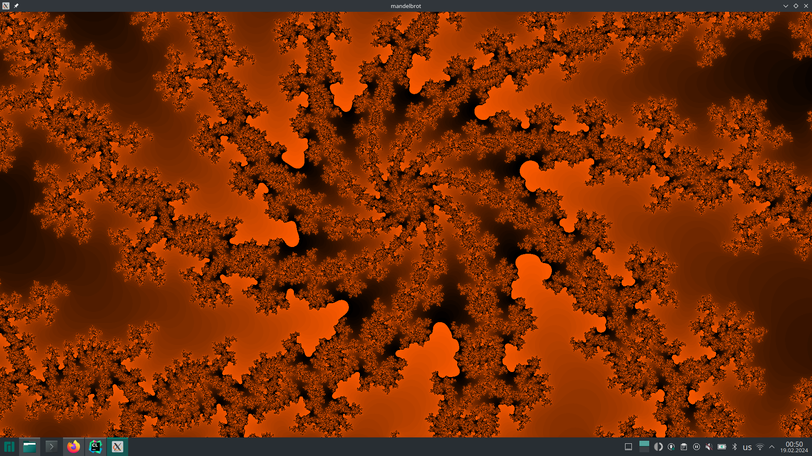
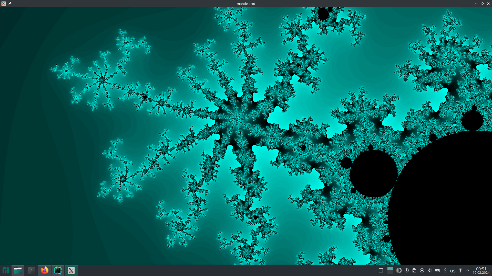

# Mandelbrot's set visualization
This project visualizes the Mandelbrot's set which is a well-known fractal in mathematics. It works with Qt6 and uses multithreading for faster calculations. The program allows to zoom in the fractal and move it around with keys/mouse. Also `F` button may be used to change the colour.

